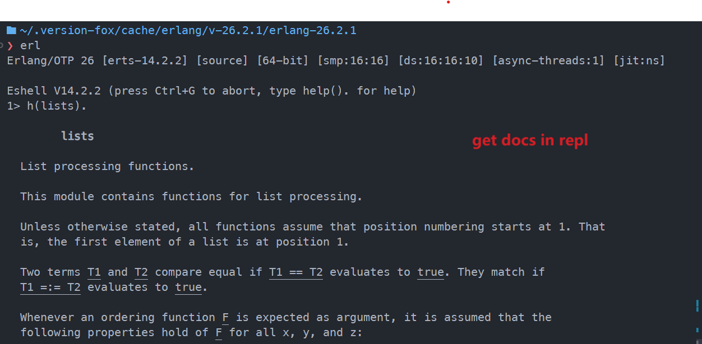

<div align="center">


[](https://github.com/version-fox/vfox-erlang/actions/workflows/e2e_test.yaml)

</div>

# vfox-erlang plugin

Erlang/OTP [vfox](https://github.com/version-fox) plugin. Use the vfox to manage multiple [Erlang/OTP](https://www.erlang.org/) versions in Linux/Darwin.

## Usage

```shell
# install plugin
vfox add --source https://github.com/version-fox/vfox-erlang/archive/refs/heads/main.zip erlang

# install an available version
vofx search erlang
# or specific version 
vfox install erlang@25.3.2.10
```

## Before install Erlang/OTP

vfox-erlang plugin would install Erlang/OTP through the [Erlang/OTP](https://www.erlang.org/doc/installation_guide/install#how-to-build-and-install-erlang-otp) source code compilation. So you must have the utilities mentioned in the document -> [Building and Installing Erlang/OTP](https://www.erlang.org/doc/installation_guide/install#how-to-build-and-install-erlang-otp). 

Here are examples of installing on Ubuntu 20.04 and MacOS 13.

### install in Linux (Ubuntu 20.04)

```shell
# install utilities
sudo apt-get -y install build-essential autoconf m4 libncurses5-dev libwxgtk3.0-gtk3-dev libwxgtk-webview3.0-gtk3-dev libgl1-mesa-dev libglu1-mesa-dev libpng-dev libssh-dev unixodbc-dev xsltproc fop libxml2-utils libncurses-dev openjdk-11-jdk
```

You can reference the E2E test in Ubuntu 20.04: [https://github.com/version-fox/vfox-erlang/actions/workflows/e2e_test.yaml](https://github.com/version-fox/vfox-erlang/actions/workflows/e2e_test.yaml)

### install in Darwin (MacOS 13)

```shell
# install utilities
brew install autoconf libxslt fop wxwidgets openssl
```

You can reference the E2E test in MacOS 13: [https://github.com/version-fox/vfox-erlang/actions/workflows/e2e_test.yaml](https://github.com/version-fox/vfox-erlang/actions/workflows/e2e_test.yaml)

## Note

By default, vfox-erlang plugin will Build [EEP-48 documentation chunks](https://www.erlang.org/doc/apps/kernel/eep48_chapter) for get doc in REPL (eg: h(list).) and [lsp docs hint](https://github.com/elixir-lsp/vscode-elixir-ls/issues/284).



You cal also use the `OTP_CONFIGURE_ARGS` environment variable to control install behavior. reference this documentation [https://github.com/erlang/otp/blob/master/HOWTO/INSTALL.md#configuring-1](https://github.com/erlang/otp/blob/master/HOWTO/INSTALL.md#configuring-1) for more configuration. eg:

```shell
# example
export OTP_CONFIGURE_ARGS="--enable-jit --enable-kernel-poll"
vfox install erlang@25.3.2.10
```
